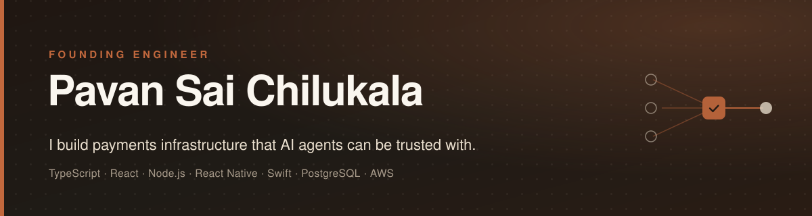
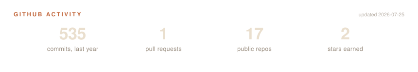

# Hi, I'm Pavan 👋

I am a Founding Engineer building a Fintech platform for agentic payments - compliance and security. I have 2 years experience in Full Stack AI mobile and web development.

---
## 💼 Experience

### Founding Software Engineer · [Harmoney Financial Technologies](https://inharmoney.xyz)
`May 2026 – Present` · Remote

First engineer. Chose the stack, architected the system, shipped an **Agentic Financial OS** built on a **KYA (Know Your Agent) protocol** from a blank repo — full-stack React + Node.js, React Native mobile, Supabase/PostgreSQL, Stripe, Plaid, Auth0. Designed agentic workflow orchestration for cross-company financial transactions. Own the full SDLC: architecture, CI/CD, production monitoring, incident response.

### iOS Developer (Volunteer) · StreetCare
`Feb 2026 – Jun 2026` · Remote

Shipped features and bug fixes in a production Swift/SwiftUI iOS app. Integrated Firestore for real-time cloud sync and CoreData for local persistence. Ran technical root cause analysis, peer code reviews, and release management.

### Graduate Teaching Assistant, Algorithms & Data Structures · University of Central Missouri
`Jan 2025 – Dec 2025`

Evaluated 500+ assignments for logical correctness, time complexity (Big O), and algorithmic efficiency. Mentored students on optimal data structure selection and scalable system design.

### Software Engineer · [Dhanush Healthcare Systems](https://www.dhanushinfotech.com/)
`Sep 2022 – Nov 2023` · Hyderabad, India

Built React Native and React/TypeScript healthcare apps serving 30M+ active users annually. Shipped **Personal Health ID** — patients enter a single identifier and authorized doctors retrieve full patient history. 60+ modular components and 150+ REST integrations across two apps; 16 production releases to App Store + Play Store. Cut turnaround time 80% via memoization and improved UI responsiveness 70% via lazy async loading.

---
## 🛠 What I Work With

**Languages**

**Frontend**

**Backend & Databases**

**AI & Agents**

**Cloud & DevOps**

---

## 🚀 Featured Projects

### 🔊 [volumeMixer](https://github.com/pavan-sai-ch/volumeMixer) · `2026`
> Swift · SwiftUI · Core Audio (CATap) · macOS

A macOS menu bar utility for independent per-application volume control. Built using low-level Core Audio Tap APIs — no third-party dependencies, no system-wide side effects. Just clean systems programming that solves a real problem.

---

### 🐾 [The Daily Wag](https://github.com/pavan-sai-ch/daily-wag-frontend) · `2025`
> React · Node.js · PHP · MySQL · AWS S3 · Docker · JWT

Full-stack pet clinic platform covering grooming, vet appointments, accessories, and adoption. Decoupled architecture, custom scheduling logic to handle concurrent bookings, admin analytics dashboard, and loyalty-based variable pricing across 200+ products.

---

### 🚗 [C3-Carpool Connect](https://github.com/pavan-sai-ch/carpool-frontend) · `2024`
> React · Python (Flask) · MongoDB Atlas · Vercel · Render · CI/CD

Real-time ride-sharing platform with sub-second geo-spatial matching latency. Automated CI/CD pipelines maintaining 99.9% uptime. Built the backend in Python with REST APIs and a React frontend.

---

### 📊 Black Friday Sales Prediction · `2022`
> Python · PyTorch · Machine Learning · Data Analysis

Predictive ML model analyzing customer behavior patterns to optimize holiday inventory stocking decisions using historical sales data.

---

## 📦 Also Built

- **Data Visualization Dashboards** `2024` — *Tableau · Business Intelligence* Trends analyzed and stories written with publicly sourced data across different websites.
- **Privacy Preservation of Biometrics** `2023` — *Java · JSP · Encryption* Secure JSP application using encryption algorithms to protect sensitive biometric data stored in the cloud.

---

## 📈 GitHub

<picture>
  <source media="(prefers-color-scheme: dark)" srcset="assets/stats-dark.svg">
  <source media="(prefers-color-scheme: light)" srcset="assets/stats-light.svg">
  
</picture>

---

## 📬 Let's Connect

I'm actively looking for my next role, and open to relocating anywhere in the US. If you're building something interesting, let's talk.

- 🌐 Portfolio: [chilukala.com](https://chilukala.com)
- 📄 Resume: [chilukala.com/resume-pavan.pdf](https://chilukala.com/resume-pavan.pdf)
- 💼 LinkedIn: [linkedin.com/in/pavanchilukala](https://linkedin.com/in/pavanchilukala)
- 📧 Email: [pavansai.ch@outlook.com](mailto:pavansai.ch@outlook.com)
